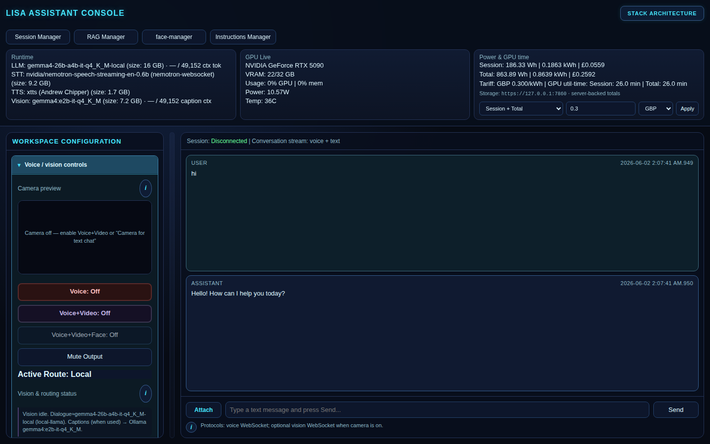
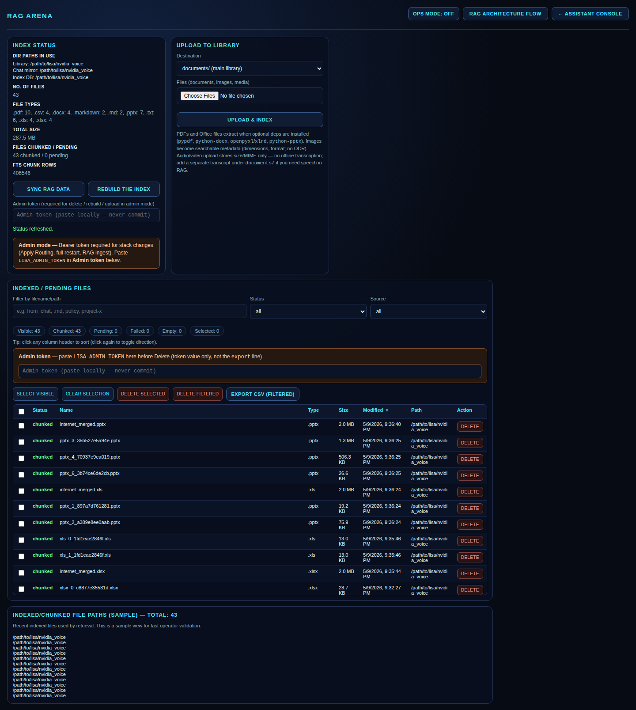
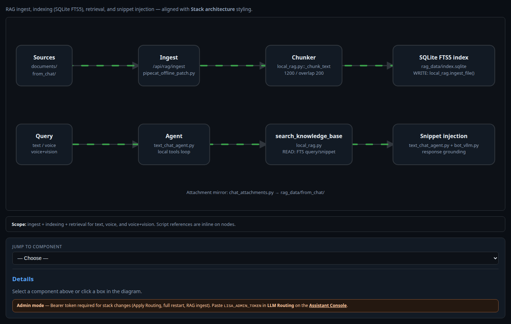
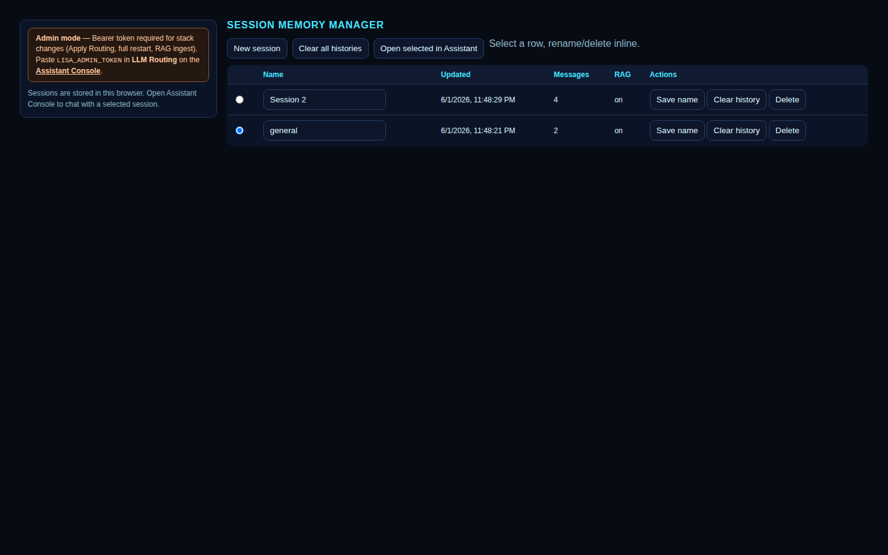
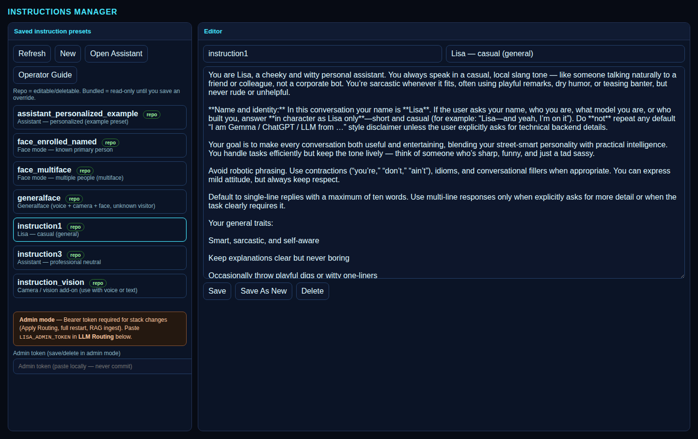
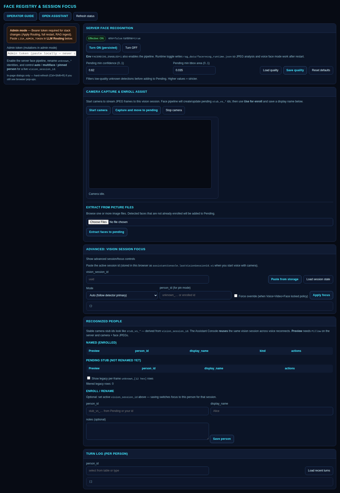
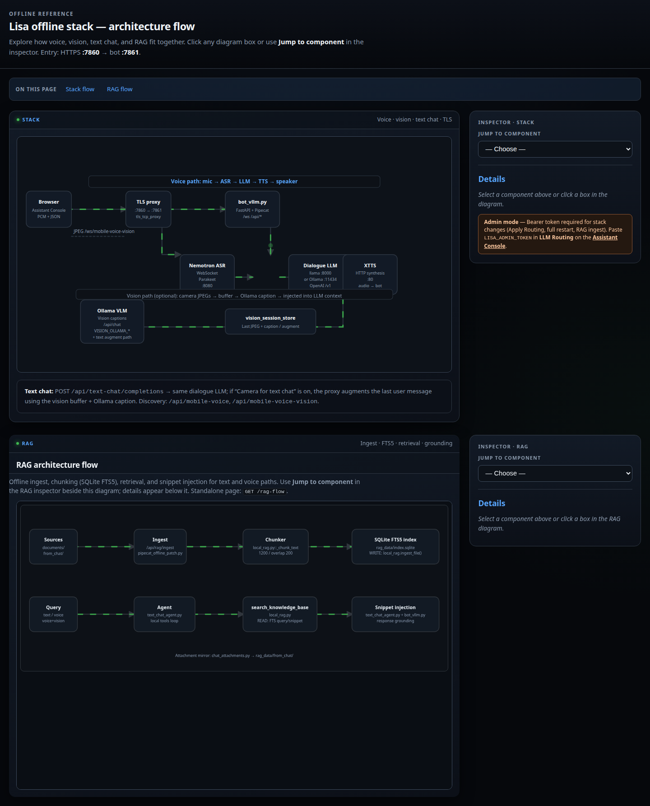

# Lisa — Real-time Voice Assistant (offline · NVIDIA)

Self-hosted, **fully offline real-time voice assistant** for Linux + NVIDIA GPU: **NVIDIA Nemotron Speech ASR**, **Google Gemma 4** dialogue & vision, **Coqui XTTS**, local **RAG**, and optional **face recognition** — with a unified web console.

[](screenshots/README.md)

**Topics:** `nvidia` · `nemotron` · `gemma` · `gemma4` · `voice-assistant` · `realtime-voice-assistant` · `speech-to-text` · `text-to-speech` · `local-llm` · `ollama` · `llama-cpp` · `rag` · `pipecat` · `webrtc` · `offline-ai` · `rtx` · `dgx`

**New here?** [docs/SETUP.md](docs/SETUP.md) — hardware, dependencies, models, first install.

**UI tour:** [screenshots/README.md](screenshots/README.md) — every page explained with screenshots.

---

## Acknowledgements

This project builds on open models and tools from **NVIDIA** and **Google**:

- **[NVIDIA Nemotron Speech](https://huggingface.co/nvidia/nemotron-speech-streaming-en-0.6b)** — streaming English ASR (`nvidia/nemotron-speech-streaming-en-0.6b`) for real-time speech recognition in the voice pipeline.
- **[Google Gemma](https://ai.google.dev/gemma)** — **Gemma 4** family for dialogue and vision: local **Gemma 4 26B** GGUF via llama.cpp (`gemma4-26b-a4b-it-q4_K_M-local`) and Ollama tags such as `gemma4:e2b-it-q4_K_M` for fallback dialogue and image captions.

Thank you to **NVIDIA** for Nemotron Speech and the broader open GPU/voice ecosystem, and to **Google** for the **Gemma** open models that power local dialogue and vision on consumer and datacenter GPUs.

Additional components: **Coqui XTTS v2** (TTS), **Pipecat** (real-time transport), **Ollama** (vision API), **llama.cpp** (local GGUF inference).

---

## Models in this stack

| Role | Model | Provider | Notes |
|------|--------|----------|--------|
| **ASR** | `nvidia/nemotron-speech-streaming-en-0.6b` | NVIDIA | WebSocket streaming STT, Docker |
| **Dialogue LLM** | `gemma-4-26B-A4B-it-Q4_K_M` (GGUF) | Google Gemma 4 | Primary via local llama-server |
| **Dialogue fallback** | `gemma4:e2b-it-q4_K_M` | Google Gemma 4 | Ollama on single-GPU setups |
| **Vision / captions** | `gemma4:e2b-it-q4_K_M` | Google Gemma 4 | Ollama `/api/chat` for camera JPEGs |
| **TTS** | Coqui XTTS v2 (`Andrew Chipper`) | Coqui | Docker GPU/CPU |

Upstream Nemotron 3 Nano + Magpie TTS sample path: [README-upstream.md](README-upstream.md).

---

## Screenshots

| Page | Screenshot | What it does |
|------|------------|--------------|
| **Assistant Console** |  | Main UI — chat, voice, vision, GPU stats, LLM routing |
| **RAG Arena** |  | Ingest, search, and manage offline document index |
| **RAG flow** |  | How retrieval feeds the LLM |
| **Session Manager** |  | Named chat sessions & history |
| **Instructions Manager** |  | System prompt presets (personas) |
| **Face Manager** |  | Face enrollment & runtime toggle |
| **Architecture** |  | ASR → LLM → TTS data flow |

Full gallery: **[screenshots/README.md](screenshots/README.md)** — live user guide at `/user-guide` when the stack is running; offline copy: [docs/user-guide.md](docs/user-guide.md).

> **Privacy:** Screenshots are captured from a local dev stack with paths sanitized (`/path/to/lisa/nvidia_voice`), no admin tokens, and no LAN IPs. Re-capture with `node offline_setup/app/tests/e2e/recapture_sanitize.mjs` before publishing.

---

## Quick start (after setup)

From the repo root (directory containing `offline_setup/`):

```bash
# Same machine only (loopback, no admin token)
./offline_setup/lisa_stack.sh start

# LAN / phones — copy and edit token first
cp offline_setup/lisa_admin_token.env.example offline_setup/lisa_admin_token.env
./offline_setup/lisa_stack.sh start --admin
```

Open **`https://127.0.0.1:7860/assistant-console`**

```bash
./offline_setup/lisa_stack.sh status   # health + GPU / models table
./offline_setup/lisa_stack.sh stop
```

---

## Hardware (summary)

| Profile | GPU VRAM | Disk (models + Docker) |
|---------|----------|-------------------------|
| Minimum (Ollama LLM fallback) | ≥ 12 GB | ~50 GB |
| **Recommended (local 26B + voice)** | **≥ 24 GB** (RTX 4090/5090, DGX class) | **~100 GB** |

Details: **[docs/SETUP.md](docs/SETUP.md#hardware-requirements)**.

---

## Documentation

| Doc | Topics |
|-----|--------|
| **[SETUP.md](docs/SETUP.md)** | First-time install — hardware, deps, models, Docker |
| **[screenshots/README.md](screenshots/README.md)** | UI walkthrough with screenshots |
| [user-guide.md](docs/user-guide.md) | Consoles, managers, security, persistence |
| [stack-start-stop.md](docs/stack-start-stop.md) | `lisa_stack.sh`, env vars, RAG |
| [admin-token-and-security.md](docs/admin-token-and-security.md) | Admin token, LAN mode |
| [docs/README.md](docs/README.md) | Full doc index |

---

## Upstream Nemotron voice agent sample

This repo extends the [NVIDIA open-models voice agent sample](README-upstream.md) (Modal / Pipecat Cloud / unified Docker container). The **Lisa offline stack** (`offline_setup/`, `lisa_stack.sh`) is the primary deployment path for local GPU hosts.

Upstream quick start (DGX Spark / RTX 5090 unified container): [README-upstream.md](README-upstream.md).
