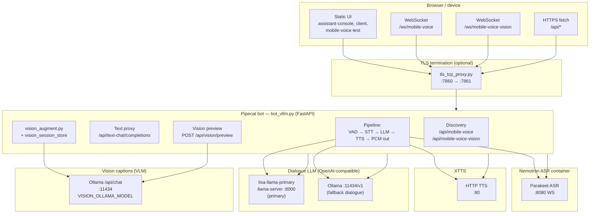
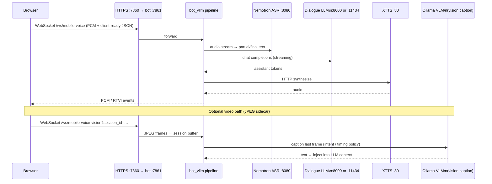
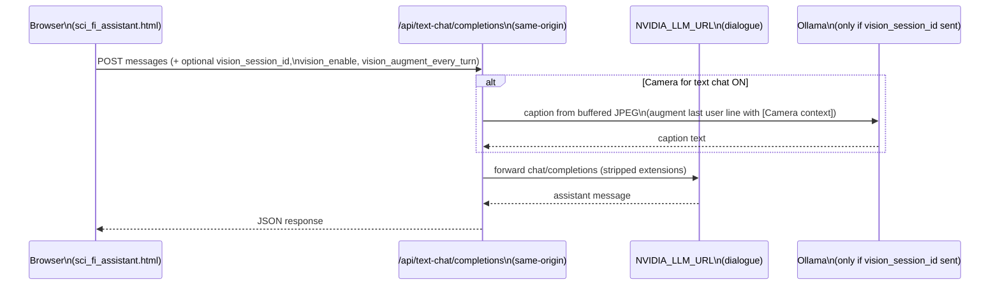

# Lisa offline stack — architecture (full reference)

This is the **single** architecture document under `docs/`: runtime components, data flow (Mermaid), how to open the **animated HTML** view, and how to **regenerate the short MP4** with the script below.

- **Stack start/stop and env:** [stack-start-stop.md](./stack-start-stop.md)
- **Voice/vision E2E tests:** [e2e_vision_voice_tests.md](./e2e_vision_voice_tests.md)

---

## Table of contents

1. [Component diagram (runtime)](#component-diagram-runtime)
2. [Sequence: voice + optional camera](#sequence-voice--optional-camera)
3. [Sequence: Assistant Console text chat](#sequence-assistant-console-text-chat)
4. [Port cheat sheet](#port-cheat-sheet)
5. [Interactive animation (browser)](#interactive-animation-browser)
6. [Generated walkthrough video (MP4)](#generated-walkthrough-video-mp4)

---

## Component diagram (runtime)

Entry point for the live stack: `offline_setup/start_current_stack.sh` (from the `lisa/nvidia_voice` tree).



---

## Sequence: voice + optional camera



---

## Sequence: Assistant Console text chat



---

## Port cheat sheet

| Service | Port | Role |
|--------|------|------|
| **HTTPS entry** | `7860` | `tls_tcp_proxy` → bot |
| **Bot HTTP** | `7861` | `bot_vllm.py` when `ENABLE_HTTPS=1` |
| **Nemotron ASR** | `8080` | WebSocket STT |
| **XTTS** | `80` | HTTP TTS |
| **Local dialogue LLM** | `8000` | llama-server (OpenAI `/v1`), when model file present |
| **Ollama** | `11434` | Fallback dialogue + **vision** captions (`/api/chat`, `/v1`) |

---

## Interactive animation (browser)

Looping **SVG/CSS** diagram (good for screen recording when the stack is running):

| URL | Notes |
|-----|--------|
| `https://127.0.0.1:7860/architecture-flow` | Via TLS proxy (typical) |
| `http://127.0.0.1:7861/architecture-flow` | Direct to bot HTTP port |
| `…/architecture_flow` | Same page (underscore alias) |

**If you see JSON `{"detail":"Not Found"}`:** the `bot_vllm.py` process still has **old code in memory**. Changing `pipecat_offline_patch.py` does nothing until you **restart the bot** (TLS proxy can stay running). Example:

```bash
# from lisa/nvidia_voice/offline_setup
./lisa_stack.sh restart
# or: pkill -f 'pipecat_bots/bot_vllm.py' && ./start_current_stack.sh
```

Verify (should print `200` and `<!DOCTYPE html>`):

```bash
curl -sS -o /dev/null -w '%{http_code}\n' http://127.0.0.1:7861/architecture-flow
curl -sS http://127.0.0.1:7861/architecture-flow | head -1
```

After a good restart, bot logs should include:  
`[offline-patch] Static diagram: GET /architecture-flow and /architecture_flow → .../static/architecture_flow.html`

Use the **bot** ports (`7860` HTTPS, `7861` HTTP), not Ollama (`11434`).

**Source file (edit this to change the rich UI):**  
`lisa/nvidia_voice/offline_setup/app/static/architecture_flow.html`  

**Route:** registered in `offline_setup/app/pipecat_bots/pipecat_offline_patch.py` as `GET /architecture-flow`.

---

## Local tools and egress (text chat)

The Assistant Console can enable **local tools** for text chat: **SQLite FTS5 RAG** over `offline_setup/rag_data/documents/`, a **local calendar** SQLite DB, and optional **HTTP POST connectors** to URLs that pass an allowlist (`TOOL_HTTP_ALLOW_*` — default loopback only). The bot runs a short **agent loop** (`/api/text-chat/completions` with `local_tools_enable` and `tool_*` flags) that calls the dialogue LLM with OpenAI-style `tools`, executes tools in-process, and never opens arbitrary internet access. Optional connector URLs are validated the same way as in [`local_tool_executor.py`](../../offline_setup/app/pipecat_bots/local_tool_executor.py). Attachments: `POST /api/chat/attachments` then pass `attachment_session_id` + `attachment_ids` on the next chat request. Discovery: `GET /api/local-tools`, `GET /api/rag/status`. See [stack-start-stop.md](./stack-start-stop.md) for environment variables.

---

## Generated walkthrough video (MP4)

A short **MP4** (~12 s, 8 fps) is produced by ImageMagick (`convert`) and **ffmpeg**. It steps a highlight through labeled boxes (browser → TLS → bot → ASR / LLM / XTTS / vision strip). Re-run after changing `gen_architecture_video.sh`; use the **HTML page** above for the detailed animated layout.

**Script:** `lisa/nvidia_voice/docs/scripts/gen_architecture_video.sh`  

**Output:** `lisa/nvidia_voice/docs/media/architecture_flow.mp4`

**Prerequisites:** `ffmpeg`, ImageMagick (`convert` on `PATH`).

**From the repository root** (the directory that contains `lisa/nvidia_voice/`):

```bash
cd lisa/nvidia_voice/docs/scripts && ./gen_architecture_video.sh
```

If your shell is **already** in `lisa/nvidia_voice`:

```bash
cd docs/scripts && ./gen_architecture_video.sh
```

That writes or overwrites `lisa/nvidia_voice/docs/media/architecture_flow.mp4` (i.e. `docs/media/architecture_flow.mp4` when the working tree is `lisa/nvidia_voice`).

Make the script executable once if needed:

```bash
chmod +x lisa/nvidia_voice/docs/scripts/gen_architecture_video.sh
```
