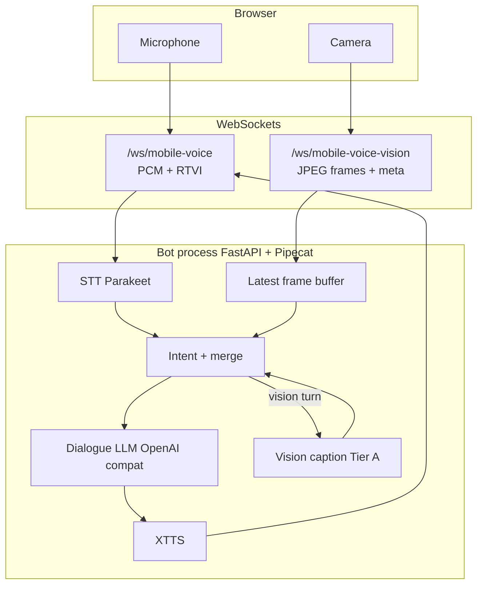

# Voice + live video — implementation build plan

This document is the **authoritative build spec** for adding **camera + microphone** realtime interaction (“what do you see?”, objects, environment) on top of the existing Lisa stack.  
Architecture summary: **`video_voice_realtime_plan.md`**.

---

## 1. Goals & non-goals

### Goals

- One **browser session**: **mic** (existing PCM pipeline) + **camera** (new path).
- User utterances trigger **vision-grounded** replies when intent is visual (*see*, *look*, *camera*, *objects*, *room*, *environment*, *what’s this*).
- **Low perceived latency** (~1–3 s after end-of-speech for vision turns on a single consumer GPU).
- **TLS same-origin** as today (`https://host:7860`).

### Non-goals (v1)

- Full **30 fps** dense video understanding on the same GPU as **26B-class LLM + XTTS + ASR**.
- **Multi-user** rooms, recording, or cloud vision APIs (unless explicitly enabled later).
- **Perfect** object detection — v1 is **scene caption / short object list** quality.

---

## 2. Architecture (build view)



**v1 transport decision (locked for implementation):**

| Stream | v1 choice |
|--------|-----------|
| Audio | **Unchanged:** existing **`/ws/mobile-voice`** binary PCM + JSON prefix. |
| Video | **New WebSocket** **`/ws/mobile-voice-vision`** — binary **JPEG** frames + optional JSON side messages (see §4). **Rationale:** no Pipecat serializer churn on the hot audio path; HTTPS proxy supports second WS path; clear separation for debugging. |

**Future:** multiplex audio+video on one WS (**§10** backlog).

---

## 3. GPU & model strategy (build constraints)

| Component | Typical VRAM pressure | v1 rule |
|-----------|------------------------|---------|
| Nemotron ASR | Moderate | Keep running. |
| XTTS | Moderate | Keep running. |
| Dialogue LLM (Gemma / local llama) | Large | **Hold** for normal turns. |
| Vision **Tier A** (small VLM) | Small–medium | Run **only** on vision-class turns; **serialize** with dialogue LLM if OOM (unload / `ollama stop` patterns already used in stack). |

**Default Tier A stack:** caption via **Ollama** small vision model (e.g. **moondream** / small **llava**) **or** HTTP to **llama.cpp** multimodal if ops standardise on one binary.

**Fallback:** CPU vision (slow) behind **`VISION_DEVICE=cpu`** for dev laptops.

---

## 4. Wire protocol — `/ws/mobile-voice-vision` (v1)

**Handshake:** client sends first message **text JSON**:

```json
{ "type": "client-ready", "max_fps": 2, "max_width": 480 }
```

**Frames:** client sends **binary** messages:

| Layout | Field |
|--------|--------|
| Byte `0` | `0x01` = JPEG payload follows |
| Bytes `1..4` | `uint32` big-endian **frame_id** (monotonic) |
| Bytes `5..8` | `uint32` big-endian **payload_len** |
| Bytes `9..` | **JPEG** bytes (`payload_len` bytes) |

**Optional:** if byte `0` is `0x02`, reserved for future **JSON meta** (skip until spec’d).

**Server → client (optional v1.1):** `{"type":"frame-ack","frame_id":123}` for backpressure.

**Rate:** client SHOULD respect **`max_fps`** (default **2**); pause when tab hidden.

---

## 5. Audio + vision merge logic (bot behaviour)

1. **Frame buffer:** server keeps **`last_jpeg`** + **`last_frame_id`** + **`received_at` mono time** per `session_id`. When **`/ws/mobile-voice-vision`** disconnects (tab close, camera off, or navigation), the handler **drops** that session’s buffer so the next vision question does not caption a stale frame. If the client keeps the socket open but stops sending JPEGs, the previous frame still expires after **`VISION_FRAME_TTL_SEC`**.
2. **On final user transcript** (STT final):  
   - **Caption merge** runs when **`vision_enable`** + **`vision_session_id`** are set **and** either **`vision_augment_every_turn`** is true for the session (client checkbox / **`client-ready`**) **or** **`VISION_AUGMENT_SESSION_LEVEL`** is **`1`**, **or** the utterance matches **`vision_intents.json`**. If none of those apply, no VLM call. Default **`VISION_AUGMENT_SESSION_LEVEL`** in code is **`0`** (regex-only; fast path). UI toggle `vision_mode` in `client-ready` still gates **`vision_enable`**. →  
     - Call **VLM(last_jpeg)** → **`camera_context` string** (wait budget from **`VISION_CAPTION_WAIT_SEC`**, default **14**).  
   - Build augmented user text for LLM from **`camera_context_template.txt`** plus policy snippets under **`pipecat_bots/vision_policy/`** (override with **`VISION_POLICY_DIR`** / per-file env vars; see **`docs/stack-start-stop.md`**).  
   - If the latest frame is older than **TTL** (**`VISION_FRAME_TTL_SEC`**, default **5** seconds since last JPEG), append: `[Camera: no recent frame]`.
3. **Else:** existing text-only path (no VLM call).

**System prompt addition:** Loaded from **`system_addon.txt`** when vision is enabled (same directory / overrides as above). User-message grounding rules live in **`substantive.txt`** / **`unavailable.txt`** / **`refresh_note.txt`** appended after the camera block.

---

## 6. REST / discovery

| Method | Path | Purpose |
|--------|------|---------|
| `GET` | `/api/mobile-voice-vision` | Discovery: WS URLs, `max_fps`, `max_width`, vision tier, model name, timeouts (mirror style of `mobile_voice_endpoint_info.py`). |
| `GET` | `/mobile-voice-vision-test` | Static HTML test page (mic + cam + logs). |
| `POST` | `/api/vision/preview` (P0 spike) | **Optional:** multipart **image** → JSON caption (validates VLM without WS). |

---

## 7. Repository file map (new / touched)

| Path | Role |
|------|------|
| `offline_setup/app/pipecat_bots/pipecat_offline_patch.py` | Register **`/ws/mobile-voice-vision`**, **`/api/mobile-voice-vision`**, **`POST /api/vision/preview`**, static route. |
| `offline_setup/app/pipecat_bots/vision_session_store.py` | Latest JPEG per `session_id` + TTL. |
| `offline_setup/app/pipecat_bots/vision_ws.py` | Vision WebSocket: **client-ready** + binary JPEG frames → store. |
| `offline_setup/app/pipecat_bots/vision_caption.py` | **`caption_jpeg(bytes) -> str`** via Ollama **`/v1/chat/completions`** (multimodal). |
| `offline_setup/app/pipecat_bots/vision_intent.py` | Vision intent API (delegates to compiled patterns). |
| `offline_setup/app/pipecat_bots/vision_intent_patterns.py` | Load **`vision_intents.json`** (or **`VISION_INTENTS_FILE`**). |
| `offline_setup/app/pipecat_bots/vision_policy/` | **`vision_intents.json`**, caption + policy **`.txt`** files (operator-tunable). |
| `offline_setup/app/pipecat_bots/vision_policy_texts.py` | Load snippets, **`format_camera_context_block`**. |
| `offline_setup/app/pipecat_bots/vision_augment.py` | Merge caption + policies into user text. |
| `offline_setup/app/pipecat_bots/bot_vllm.py` | **`VisionTranscriptionProcessor`** after STT; **`vision_session_id`** / **`vision_enable`** from runner body. |
| `offline_setup/app/pipecat_bots/mobile_voice_vision_endpoint_info.py` | **`GET /api/mobile-voice-vision`** JSON. |
| `offline_setup/app/static/mobile_voice_vision_test.html` | Mic + camera → dual WebSocket test UI. |
| `offline_setup/start_current_stack.sh` | Echo vision URLs; pass **`VISION_OLLAMA_*`** into bot `env`. |
| `docs/video_voice_build_plan.md` | This file. |
| `docs/links.md`, **`docs/stack-start-stop.md`** | URLs, env table, testing notes. |
| `offline_setup/lisa_stack.sh` | **`status`**: probe **`/api/mobile-voice-vision`**; help mentions vision env. |

---

## 8. Milestones, acceptance criteria, order

### M0 — Spec complete

- **Done when:** this doc reviewed; transport (`§4`) frozen for v1.

### M1 — Vision backend spike (no voice)

- Implement **`vision_caption.caption_jpeg`** + **`POST /api/vision/preview`**.
- **Acceptance:** curl or browser posts a JPEG → returns caption JSON &lt; **15 s** on target GPU.
- **Dependency:** Ollama model pulled or llama endpoint configured.

### M2 — Frame WebSocket only

- **`/ws/mobile-voice-vision`** accepts **client-ready** + JPEG stream; server logs **fps** + stores **`last_jpeg`**.
- **Acceptance:** test page shows **connected** + server logs frame_ids; **no** LLM yet.

### M3 — Voice + vision merge (MVP)

- **`bot_vllm`** fork or branch: on **final transcript** + vision intent → **VLM** → **LLM** → **TTS** unchanged.
- **Acceptance:** spoken answer references something plausible from a **held-up object** test; latency measured (log).

### M4 — Assistant Console parity (optional)

- Link or embed pattern from **`sci_fi_assistant.html`** (second WS, camera toggle).

### M5 — Hardening

- Metrics: vision **TTFT**, **caption length**, **OOM** count.
- Backpressure: drop frames if buffer **> N** pending VLM calls.

---

## 9. Test matrix

| Case | Expected |
|------|----------|
| Vision WS only, no frames | LLM never calls VLM; no crash. |
| Frames, user says unrelated text | No VLM (intent off). |
| Frames, “what do you see?” | VLM + grounded reply. |
| No frames, vision question | Reply: can’t see camera / no recent picture. |
| VLM timeout | Graceful string + spoken fallback. |

---

## 10. Backlog (post-v1)

- **Multiplex** audio+video on **`/ws/mobile-voice`** (single serializer).
- **WebRTC** video track + encoded relay (lower CPU than JPEG).
- **Tier B** single multimodal LLM switch.
- **Ring buffer** of last **K** frames for motion.

---

## 11. Security & privacy

- Same **HTTPS** as Assistant; **no** persistent frame storage by default.
- Document in UI: **camera** may be processed **on device GPU path** (server-side inference).

---

## 12. Open questions (resolve before M3)

1. **Exact** Ollama model name(s) pinned in `start_current_stack.sh` or env?
2. **Intent list:** regex only vs small classifier vs LLM judge (cost)?
3. **Exclusive VRAM policy:** pause dialogue LLM during VLM always vs try parallel?

---

*Version: 1.0 — build planning artifact; update milestones as implementation lands.*
