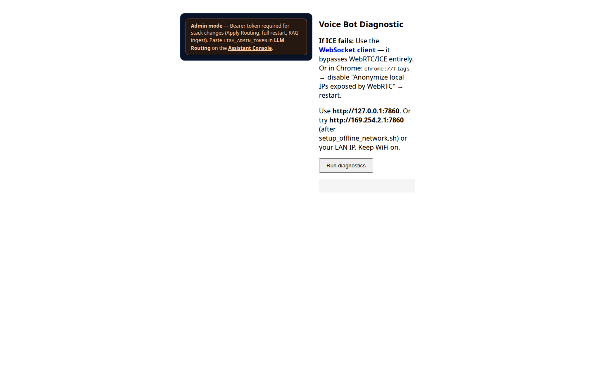
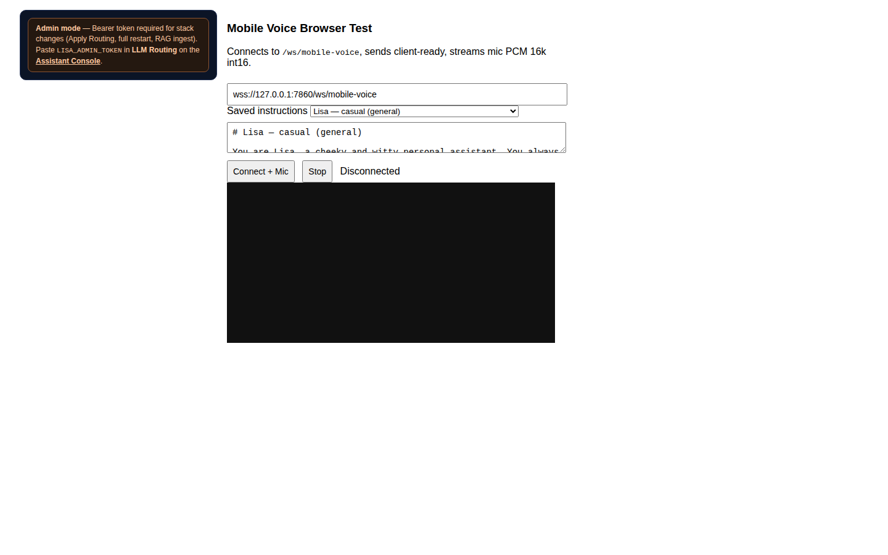
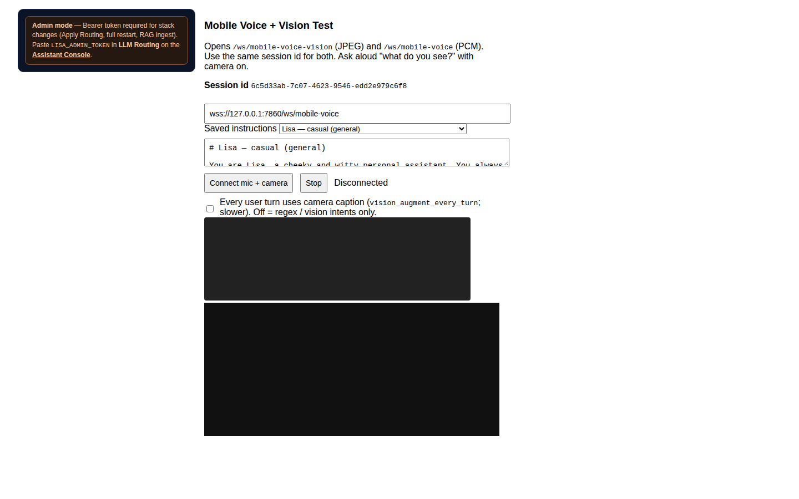
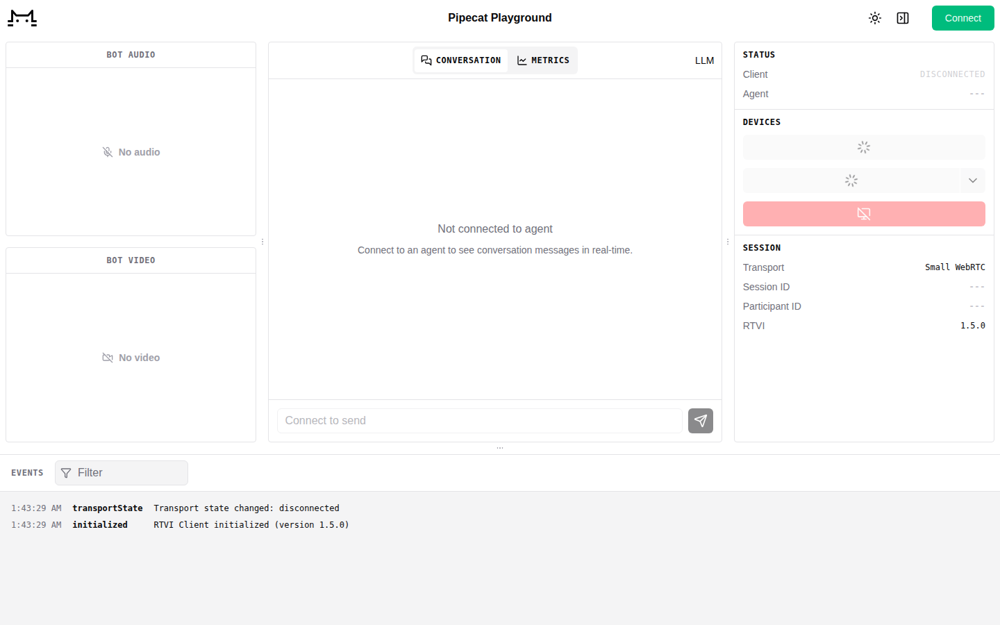
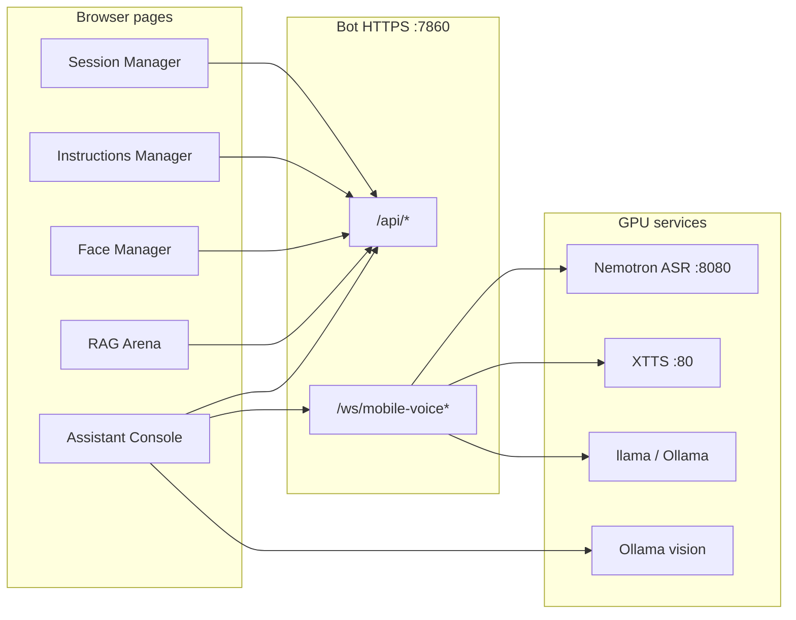

# Lisa UI screenshots & feature guide

Visual walkthrough of every operator-facing page. Screenshots were captured with the stack running at `https://127.0.0.1:7860` with all collapsible `<details>` sections expanded.

## Privacy & sensitive data

Screenshots in this folder are intended for **public documentation**. Before commit/push we verify:

| Check | Status |
|-------|--------|
| No `LISA_ADMIN_TOKEN` or hex secrets in images | Admin token fields left **empty** at capture time |
| No machine-specific home paths | Replaced with `/path/to/lisa/nvidia_voice` via `recapture_sanitize.mjs` |
| No LAN IPs (`192.168.x.x`) | Replaced with `<LAN-IP>` when present |
| Only `127.0.0.1` localhost URLs | OK for docs |
| RAG filenames | Generic regression corpus names only (no user PII in paths) |
| Personal presets | No real people's names — use `*_example.md` templates locally |

**Initial capture note:** the first `03-rag-arena.png` briefly contained real disk paths; it was **re-captured and sanitized** before push. Always run `recapture_sanitize.mjs` after re-capturing on a machine with live RAG data.

**Regenerate (sanitized):** start the stack, then from `offline_setup/app/tests/e2e`:

```bash
cd offline_setup/app/tests/e2e
PLAYWRIGHT_BASE_URL=https://127.0.0.1:7860 node capture_ui_screenshots.mjs
node capture_assistant_console.mjs
node recapture_sanitize.mjs   # scrub paths/tokens on sensitive pages
```

Do **not** pass `LISA_ADMIN_TOKEN` into capture scripts — leave admin fields empty.

---

## Page index

| Screenshot | URL | Purpose |
|------------|-----|---------|
| [01-assistant-console*.png](01-assistant-console.png) | `/assistant-console` | Main operator console — chat, voice, vision, config |
| *(no screenshot)* | `/user-guide` | In-app docs — see [docs/user-guide.md](../docs/user-guide.md) |
| [03-rag-arena.png](03-rag-arena.png) | `/rag-arena` | RAG index management — ingest, search, delete |
| [04-rag-flow.png](04-rag-flow.png) | `/rag-flow` | RAG pipeline diagram |
| [05-session-manager.png](05-session-manager.png) | `/session-manager` | Chat session list & sync |
| [06-instructions-manager.png](06-instructions-manager.png) | `/instructions-manager` | System prompt presets (CRUD) |
| [07-face-manager.png](07-face-manager.png) | `/face-manager` | Face enrollment & runtime |
| [08-diagnose.png](08-diagnose.png) | `/diagnose` | Connectivity diagnostics |
| [09-mobile-voice-test.png](09-mobile-voice-test.png) | `/mobile-voice-test` | Browser voice WebSocket test |
| [10-mobile-voice-vision-test.png](10-mobile-voice-vision-test.png) | `/mobile-voice-vision-test` | Voice + camera JPEG test |
| [11-architecture-flow.png](11-architecture-flow.png) | `/architecture-flow` | Stack architecture diagram |
| [12-client-playground.png](12-client-playground.png) | `/client` | Pipecat WebRTC playground |

---

## 1. Assistant Console (`/assistant-console`)


The primary UI for day-to-day use. Split into a **left configuration sidebar** and a **right chat / voice workspace**.

### Header bar

| Control | Feature |
|---------|---------|
| **Stack architecture** | Opens `/architecture-flow` — visual data-flow diagram |
| **Session Manager** | Opens `/session-manager` — manage named chat sessions |
| **RAG Manager** | Opens `/rag-arena` — document index & ingest |
| **face-manager** | Opens `/face-manager` — enroll faces, toggle recognition |
| **Instructions Manager** | Opens `/instructions-manager` — edit system prompt presets |

### Status cards (top of sidebar)

| Card | What it shows |
|------|----------------|
| **Runtime** | Active LLM, STT, TTS, and vision models with approximate VRAM and context size |
| **GPU Live** | `nvidia-smi` snapshot: VRAM used/total, GPU util %, power (W), temperature |
| **Power & GPU time** | Session and cumulative Wh/kWh/cost; tariff field (GBP/USD/EUR/INR) and **Apply** |

### Voice / vision controls (collapsible)

| Control | Feature |
|---------|---------|
| **Voice: Off/On** | Connects WebSocket voice pipeline (`/ws/mobile-voice`) — mic → ASR → LLM → TTS |
| **Voice+Video: Off/On** | Adds camera JPEG stream to voice (`/ws/mobile-voice-vision`) |
| **Voice+Video+Face: Off/On** | Enables face recognition pipeline on video frames |
| **Mute Output** | Silences TTS playback in the browser |
| **Camera preview** | Live JPEG preview when camera is active |
| **Camera for text chat** | Sends periodic camera frames during text-only chat |
| **Every reply uses live camera** | Forces vision caption on every text reply |
| **LLM verbose (debug)** | Extra logging in chat footer |
| **Expand thinking blocks** | Auto-open model “thinking” sections in chat |

### Core session & instructions (collapsible)

| Control | Feature |
|---------|---------|
| **WebSocket URL** | Voice endpoint (default `wss://127.0.0.1:7860/ws/mobile-voice`) |
| **Saved instruction preset** | Dropdown of YAML/Markdown presets (examples, face modes, general, etc.) |
| **Saved chat sessions** | Switch between persisted chat histories |
| **New / Rename / Delete** | Session CRUD (synced to server JSON) |
| **System Instructions** | Editable system prompt for the active session |

### LLM generation (collapsible)

Sampling parameters for **text chat** and the **next voice connection**:

| Field | Purpose |
|-------|---------|
| **Max tokens (reply)** | Upper bound on assistant response length |
| **Temperature** | Randomness (0 = deterministic) |
| **Min reply tokens** | Voice floor — server raises max_tokens if below this |
| **Top-p** | Optional nucleus sampling |
| **Text history lines** | How many prior turns to include |
| **Text chat max prompt tokens/chars** | Truncation budget before LLM call |

### Local RAG index (collapsible)

| Control | Feature |
|---------|---------|
| **Sync RAG data** | Pull filesystem changes into index metadata |
| **Rebuild the index** | Full FTS5 re-ingest from `offline_setup/rag_data/documents/` |

### Tool Management (collapsible)

Offline agent tools for text chat (no public internet):

| Toggle | Feature |
|--------|---------|
| **Local RAG** | Agent can query SQLite FTS index |
| **Calendar** | Optional HTTP connector to local calendar API |
| **Generic connector** | POST JSON to allowlisted URL (`TOOL_HTTP_ALLOW_*`) |

### LLM Routing (collapsible)

| Control | Feature |
|---------|---------|
| **Local / Ollama** | Choose dialogue backend |
| **URL / model override** | Manual OpenAI-compatible endpoint |
| **Ollama model dropdown** | Tags from `ollama list` |
| **Admin token** | Required for **Apply Routing** when stack runs in LAN admin mode |
| **Apply Routing (Restart Stack)** | Switches LLM route and restarts ASR + XTTS + bot |

### Full stack restart (collapsible)

| Control | Feature |
|---------|---------|
| **Restart full stack** | Runs `start_current_stack.sh` — several minutes, page may disconnect |
| **Context stress test** | Optional GPU/VRAM stress (requires `ENABLE_CONTEXT_STRESS_RUN_API=1`) |

### Chat workspace (right panel)

| Element | Feature |
|---------|---------|
| **Session status line** | Voice WebSocket state + mode (voice + text) |
| **Message log** | USER / ASSISTANT turns with timestamps |
| **Attach** | Upload files into session-scoped RAG attachments |
| **Text input + Send** | Text chat via `/api/text-chat/completions` |
| **Footer** | Protocol note (voice WS, optional vision WS) |

**Sidebar scroll captures:** removed from repo (use `01-assistant-console.png` full-page capture).

---

## 2. User Guide (`/user-guide`)

No screenshot in this repo (long scrollable page). Use the live page at **`https://127.0.0.1:7860/user-guide`** when the stack is running, or the offline copy **[docs/user-guide.md](../docs/user-guide.md)**.

Topics covered: quick start, `lisa_stack.sh`, URLs/ports, managers, models & GPU, security, persistence.

---

## 3. RAG Arena (`/rag-arena`)


Manage the **offline lexical RAG index** (SQLite FTS5 under `offline_setup/rag_data/`).

| Section | Feature |
|---------|---------|
| **Index status** | Document count, index size, last ingest time |
| **Ingest** | Scan `documents/` folder, upload files, reindex all |
| **Search** | Test FTS queries against the index |
| **File list** | Browse indexed paths with delete per file |
| **Admin token** | Required for delete/ingest when `LISA_ADMIN_TOKEN` is enforced |

Documents placed in `offline_setup/rag_data/documents/` (.md, .txt, etc.) are ingested here. Chat attachments land in `attachments/{session_id}/`.

---

## 4. RAG Flow (`/rag-flow`)


Static diagram of how user queries flow through:

1. User message (text or voice)
2. Optional RAG retrieval from FTS index
3. LLM completion
4. Response to UI / TTS

Useful for understanding where RAG hooks in relative to the dialogue LLM.

---

## 5. Session Manager (`/session-manager`)


Dedicated view for **chat session persistence**:

| Feature | Description |
|---------|-------------|
| Session list | All saved sessions with message counts |
| Activate | Switch the active session (syncs with Assistant Console) |
| Rename / Delete | Manage session metadata |
| Sync from server | Pull latest `assistant_console_chat_sessions.v1.json` |

Sessions survive browser refresh and stack restart (stored server-side).

---

## 6. Instructions Manager (`/instructions-manager`)


CRUD for **system prompt presets** stored as Markdown under `docs/instructions/` and `offline_setup/app/presets/instructions/`.

| Feature | Description |
|---------|-------------|
| Preset list | Named instructions (Lisa casual, example presets, face modes, vision, etc.) |
| Edit body | Markdown system prompt text |
| Save / Delete | Writes files on disk (admin token required in LAN mode) |
| Set default | Which preset loads for new sessions |

These presets appear in the Assistant Console **Saved instruction preset** dropdown.

---

## 7. Face Manager (`/face-manager`)


Local **face recognition registry** (SQLite under `offline_setup/app/rag_data/`).

| Section | Feature |
|---------|---------|
| **Runtime toggle** | Turn face pipeline ON/OFF (persisted) |
| **Admin token** | Auth for enroll/delete in LAN mode |
| **Enroll** | Add a person from a vision session or upload |
| **Person list** | Enrolled identities with thumbnails |
| **Delete** | Remove enrollment |
| **Session focus** | Link face context to a vision session |

Enable **Voice+Video+Face** in the Assistant Console to use enrolled identities during conversation.

---

## 8. Diagnose (`/diagnose`)



Quick **health checks** for stack connectivity:

- Bot HTTPS reachability
- ASR / TTS / LLM endpoint probes
- Useful when a service is down or ports conflict

---

## 9. Mobile Voice Test (`/mobile-voice-test`)



Minimal **browser test harness** for the voice WebSocket pipeline:

- Connect / disconnect voice
- Shows ASR partial/final text and bot audio
- Uses `/ws/mobile-voice` and discovery from `/api/mobile-voice`

Good for debugging mic permissions and latency without the full Assistant Console.

---

## 10. Mobile Voice + Vision Test (`/mobile-voice-vision-test`)



Extends the voice test with **camera JPEG streaming**:

- Camera capture → `/ws/mobile-voice-vision`
- Vision session ID for caption context
- Discovery from `/api/mobile-voice-vision`

Use for testing phone browsers and camera + mic together.

---

## 11. Architecture Flow (`/architecture-flow`)


Interactive / visual map of the **Lisa offline stack**:

- Browser → TLS proxy (:7860) → bot (:7861)
- ASR (Nemotron :8080), TTS (XTTS :80), LLM (llama :8000 or Ollama :11434)
- Vision caption path via Ollama

Linked from **Stack architecture** in the Assistant Console header.

---

## 12. Client Playground (`/client`)



Default **Pipecat WebRTC client** (`/client`) — lower-level playground for WebRTC transport testing, separate from the Assistant Console’s WebSocket voice path.

---

## How the app fits together



**Typical workflow:**

1. `./offline_setup/lisa_stack.sh start` (or `--admin` for LAN)
2. Open **Assistant Console** — pick instruction preset and session
3. Use **text chat** or enable **Voice / Voice+Video / Voice+Video+Face**
4. Add documents via **RAG Arena** for grounded answers
5. Enroll faces via **Face Manager** for personalized prompts
6. Tune models via **LLM Routing** or env vars; monitor **GPU Live** card

For install requirements see [docs/SETUP.md](../docs/SETUP.md).
